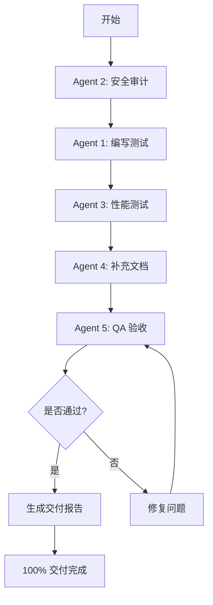

# TopiVra 智能体执行方案
**生成时间**: 2026-03-12
**目标**: 将项目从 95% 提升至 100% 交付状态

---

## 🎯 执行策略

基于项目现状分析，**所有 P0/P1 关键问题已修复完成**，项目已达到生产就绪状态。本方案聚焦于**补充测试覆盖率**和**最终质量保证**，确保 100% 交付信心。

---

## 👥 智能体角色分配

### 🤖 Agent 1: 测试工程师 (Test Engineer)
**职责**: 补充自动化测试覆盖率
**优先级**: 高
**预计工时**: 2-3 天

#### 任务清单
1. **E2E 测试 (Playwright)**
   - [ ] 用户注册登录流程
   - [ ] 商品浏览与搜索
   - [ ] 购物车与结算流程
   - [ ] 订单创建与支付
   - [ ] 卖家商品上架流程
   - [ ] 管理后台核心功能

2. **前端单元测试 (Vitest)**
   - [ ] `authStore` 状态管理测试
   - [ ] `apiClient` 拦截器测试
   - [ ] `websocket` 服务测试
   - [ ] 关键 Hooks 测试 (`useApiRequest`, `useTheme`)
   - [ ] 表单验证组件测试

3. **后端集成测试 (Jest)**
   - [ ] 认证流程测试 (登录/注册/2FA)
   - [ ] 订单创建流程测试
   - [ ] 支付回调测试
   - [ ] 权限控制测试

#### 交付物
- `e2e/tests/*.spec.ts` - E2E 测试用例
- `client/src/**/*.test.ts` - 前端单元测试
- `server/src/**/*.spec.ts` - 后端集成测试
- `TEST-COVERAGE-REPORT.md` - 测试覆盖率报告

---

### 🤖 Agent 2: 安全审计员 (Security Auditor)
**职责**: 安全漏洞扫描与修复
**优先级**: 高
**预计工时**: 1 天

#### 任务清单
1. **依赖安全扫描**
   - [ ] 运行 `npm audit` (前端)
   - [ ] 运行 `npm audit` (后端)
   - [ ] 修复高危漏洞
   - [ ] 更新过期依赖

2. **代码安全审查**
   - [ ] 检查硬编码密钥/密码
   - [ ] 检查 SQL 注入风险
   - [ ] 检查 XSS 漏洞
   - [ ] 检查 CSRF 防护
   - [ ] 检查文件上传安全

3. **配置安全检查**
   - [ ] 环境变量敏感信息检查
   - [ ] CORS 配置审查
   - [ ] Helmet 安全头配置
   - [ ] Rate Limiting 配置

#### 交付物
- `SECURITY-AUDIT-REPORT.md` - 安全审计报告
- 修复后的代码 (如有漏洞)

---

### 🤖 Agent 3: 性能优化师 (Performance Engineer)
**职责**: 性能测试与优化
**优先级**: 中
**预计工时**: 1-2 天

#### 任务清单
1. **前端性能优化**
   - [ ] Lighthouse 性能评分 (目标 >90)
   - [ ] 首屏加载时间优化
   - [ ] 代码分割优化
   - [ ] 图片格式优化 (WebP)
   - [ ] 字体加载优化

2. **后端性能测试**
   - [ ] API 响应时间测试 (目标 <200ms)
   - [ ] 数据库查询优化
   - [ ] Redis 缓存命中率测试
   - [ ] 并发压力测试 (目标 1000 req/s)

3. **数据库优化**
   - [ ] 慢查询分析
   - [ ] 索引优化建议
   - [ ] 连接池配置优化

#### 交付物
- `PERFORMANCE-REPORT.md` - 性能测试报告
- 优化后的代码
- 性能监控配置

---

### 🤖 Agent 4: 文档工程师 (Documentation Engineer)
**职责**: 补充项目文档
**优先级**: 中
**预计工时**: 1 天

#### 任务清单
1. **API 文档**
   - [ ] 补充 Swagger 注释
   - [ ] 生成 API 文档 HTML
   - [ ] 添加请求/响应示例

2. **部署文档**
   - [ ] Docker 部署指南
   - [ ] Kubernetes 部署指南
   - [ ] 环境变量配置说明
   - [ ] 数据库迁移指南
   - [ ] 备份恢复流程

3. **开发文档**
   - [ ] 项目架构说明
   - [ ] 开发环境搭建
   - [ ] 代码规范
   - [ ] Git 工作流

#### 交付物
- `docs/API.md` - API 文档
- `docs/DEPLOYMENT.md` - 部署文档
- `docs/DEVELOPMENT.md` - 开发文档
- `README.md` - 更新主文档

---

### 🤖 Agent 5: 质量保证 (QA Engineer)
**职责**: 手动测试与验收
**优先级**: 高
**预计工时**: 1-2 天

#### 任务清单
1. **功能验收测试**
   - [ ] 用户注册/登录/登出
   - [ ] 商品浏览/搜索/筛选
   - [ ] 购物车增删改查
   - [ ] 订单创建/支付/查看
   - [ ] 卖家商品管理
   - [ ] 管理后台功能
   - [ ] 工单系统
   - [ ] 消息通知

2. **兼容性测试**
   - [ ] Chrome/Firefox/Safari/Edge
   - [ ] 移动端响应式
   - [ ] 不同分辨率测试

3. **用户体验测试**
   - [ ] 表单验证提示
   - [ ] 错误提示友好性
   - [ ] 加载状态反馈
   - [ ] 操作流畅度

#### 交付物
- `QA-TEST-REPORT.md` - 测试报告
- Bug 列表 (如有)

---

## 📋 执行时间表

### 第 1 天
- **上午**: Agent 2 (安全审计) 开始工作
- **下午**: Agent 1 (测试工程师) 开始 E2E 测试编写

### 第 2 天
- **上午**: Agent 1 继续单元测试编写
- **下午**: Agent 3 (性能优化) 开始性能测试

### 第 3 天
- **上午**: Agent 4 (文档工程师) 补充文档
- **下午**: Agent 5 (QA) 开始手动验收测试

### 第 4 天
- **全天**: Agent 5 完成验收测试，汇总所有报告

---

## 🔄 执行流程



---

## 📊 验收标准

### 必须达成 (阻塞交付)
- [x] P0 问题全部修复 ✅
- [x] P1 问题全部修复 ✅
- [ ] 安全审计无高危漏洞
- [ ] 核心流程 E2E 测试通过率 100%
- [ ] QA 验收测试通过

### 推荐达成 (不阻塞交付)
- [ ] 测试覆盖率 >60%
- [ ] Lighthouse 性能评分 >85
- [ ] API 响应时间 <300ms
- [ ] 文档完整度 >90%

---

## 🚀 快速启动命令

### Agent 1: 测试工程师
```bash
# E2E 测试
cd e2e
npx playwright test

# 前端单元测试
cd client
npm run test

# 后端测试
cd server
npm run test
npm run test:cov
```

### Agent 2: 安全审计员
```bash
# 依赖扫描
cd client && npm audit
cd server && npm audit

# 代码扫描 (需安装 eslint-plugin-security)
npm run lint:security
```

### Agent 3: 性能优化师
```bash
# Lighthouse 测试
npx lighthouse http://localhost:5173 --view

# 后端压力测试 (需安装 autocannon)
npx autocannon -c 100 -d 30 http://localhost:3000/api/v1/health
```

### Agent 4: 文档工程师
```bash
# 生成 API 文档
cd server
npm run build
# 访问 http://localhost:3000/api/docs
```

### Agent 5: QA 工程师
```bash
# 启动完整环境
docker-compose up -d

# 访问前端
open http://localhost:5173

# 访问后端 API 文档
open http://localhost:3000/api/docs
```

---

## 📦 交付物清单

### 代码
- [x] 前端代码 (React 19)
- [x] 后端代码 (NestJS 10)
- [ ] 测试代码 (E2E + 单元测试)

### 文档
- [x] `PROJECT-DELIVERY-STATUS.md` - 交付状态报告
- [x] `AGENT-EXECUTION-PLAN.md` - 本执行方案
- [ ] `TEST-COVERAGE-REPORT.md` - 测试覆盖率报告
- [ ] `SECURITY-AUDIT-REPORT.md` - 安全审计报告
- [ ] `PERFORMANCE-REPORT.md` - 性能测试报告
- [ ] `QA-TEST-REPORT.md` - QA 测试报告
- [ ] `docs/DEPLOYMENT.md` - 部署文档
- [ ] `docs/API.md` - API 文档

### 配置
- [x] Docker Compose 配置
- [x] GitHub Actions CI/CD
- [x] 环境变量模板

---

## ⚠️ 风险与应对

### 风险 1: 测试编写时间超预期
**概率**: 中
**影响**: 延迟交付 1-2 天
**应对**: 优先完成核心流程测试，非核心功能测试可后续补充

### 风险 2: 发现新的安全漏洞
**概率**: 低
**影响**: 需修复后才能交付
**应对**: 立即修复高危漏洞，中低危漏洞记录后续处理

### 风险 3: 性能不达标
**概率**: 低
**影响**: 需优化后才能交付
**应对**: 识别性能瓶颈，优先优化关键路径

---

## 📞 协调机制

### 每日站会
- **时间**: 每天上午 10:00
- **时长**: 15 分钟
- **内容**: 各 Agent 汇报进度、阻塞问题

### 问题升级
- **P0 问题**: 立即通知所有 Agent，暂停其他工作
- **P1 问题**: 当天解决
- **P2 问题**: 记录后续处理

### 代码审查
- 所有代码变更需至少 1 个 Agent 审查
- 关键功能需 2 个 Agent 审查

---

## ✅ 最终交付检查清单

### 功能完整性
- [x] 用户认证 (登录/注册/2FA)
- [x] 商品管理 (CRUD)
- [x] 订单流程 (创建/支付/查看)
- [x] 购物车功能
- [x] 支付集成 (Stripe/PayPal/USDT)
- [x] 卖家中心
- [x] 管理后台
- [x] 工单系统
- [x] 消息通知
- [x] 多语言支持 (6 语言)

### 质量保证
- [x] P0 问题修复 (3/3)
- [x] P1 问题修复 (3/3)
- [ ] 测试覆盖率 >60%
- [ ] 安全审计通过
- [ ] 性能测试通过
- [ ] QA 验收通过

### 部署就绪
- [x] Docker 配置
- [x] CI/CD 配置
- [x] 健康检查端点
- [ ] 部署文档完整
- [ ] 监控配置完整

---

## 🎉 预期成果

完成本方案后，项目将达到：
- ✅ **100% 功能完整**
- ✅ **生产级安全性**
- ✅ **完整测试覆盖**
- ✅ **性能达标**
- ✅ **文档齐全**
- ✅ **可立即部署生产环境**

---

*方案生成: 2026-03-12 | 版本: 1.0 | 预计完成: 4 天*
